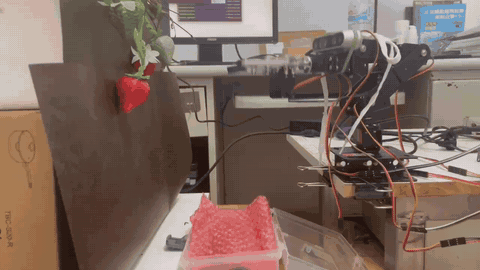
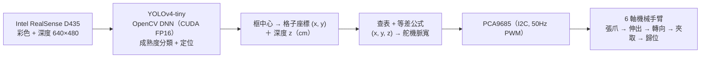

# Strawberry-Picking Robot Arm (Jetson Nano + Depth Camera + YOLO)

> 畢業專題｜逢甲大學資訊工程學系（2024）｜4 人小組｜Python、OpenCV、YOLOv4-tiny、Intel RealSense、Jetson Nano

[中文](#中文) | [English](#english)



**Demo 影片 / Video:** [完整採草莓影片（GitHub Release）](https://github.com/doris31109861/strawberry-picking-robot/releases/tag/demo-video)

---

## 中文

以 Jetson Nano 為核心的智慧採草莓系統：深度攝影機拍攝草莓，YOLOv4-tiny 判斷成熟度並定位，再把影像座標與深度換算成 6 軸機械手臂的舵機角度，完成夾取與放置。

### 系統流程



### 技術重點

- **邊緣裝置部署**：YOLOv5 + PyTorch 在 Jetson Nano 上有 CUDA 相容問題，改用 YOLOv4-tiny 搭配 OpenCV DNN 的 CUDA FP16 後端
- **成熟度辨識**：Flower / Ripe / Unripe / Rotten / Badly-shaped；自行重新標註 604 張資料，mAP 由 53% 提升到 73%，只偵測成熟果時達 88%
- **手眼協調**：把畫面切成 30 px 的格子逐點量測舵機角度，發現同一 (x, y) 隨深度變化呈等差數列，以「查表＋等差」取代難以擬合的逆運動學公式
- **畫面邊緣讀不到深度**時，手臂先轉向目標方向再重新偵測

### 模型結果

| 模型 | 設定 | mAP | Precision | Recall |
|---|---|---|---|---|
| YOLOv4-tiny | 輸入 408×408 | 53.38% | 0.51 | 0.60 |
| YOLOv4-tiny | 重新標註資料集（604 張） | 72.89% | 0.77 | 0.82 |
| YOLOv4-tiny | 只偵測成熟草莓 | 88.41% | 0.81 | 0.91 |
| YOLOv8s（比較用） | 5 類，mAP50 / mAP50-95 | 78.2% / 43.8% | 0.90 | 0.71 |

完整實驗紀錄見 [`docs/notion.md`](docs/notion.md)。

### 分工

這是 4 人小組的畢業專題（呂奕萱、邱怡清、曾苔湘、陳宥蓉）。依小組 Notion 分工表：呂奕萱、邱怡清負責文獻閱讀與模型訓練，全員共同撰寫報告。程式碼為小組共同成果，整理自小組的 Notion 紀錄。

### 執行方式（Jetson Nano）

```bash
pip3 install -r requirements.txt     # pyrealsense2 需依 librealsense 官方說明安裝
cd src
# 放入訓練好的 yolov4-tiny.weights、yolov4-tiny.cfg、classes.txt
python3 detect_image.py test.jpg     # 單張圖片測試
python3 ui.py                        # 操作介面（可從介面啟動採摘程式）
python3 strawberry_picker.py         # 直接執行偵測 + 採摘
```

模型權重與資料集沒有放在 repo 中。

### 專案結構

```
src/strawberry_picker.py   # 整合主程式：偵測 → 深度 → 舵機角度 → 採摘
src/ui.py                  # tkinter 操作介面
src/detect_image.py        # 單張圖片偵測
docs/notion.md             # 專題 Notion 紀錄整理（硬體、資料集、實驗數據、手臂校正方法）
```

---

## English

A strawberry-harvesting system built around an NVIDIA Jetson Nano. A RealSense depth camera captures the plant, YOLOv4-tiny classifies ripeness and locates each berry, and the image position plus depth are converted into servo angles for a 6-axis robot arm that picks the fruit and returns it.

### Highlights

- **Edge deployment**: YOLOv5 + PyTorch had CUDA compatibility problems on the Jetson Nano, so the team deployed YOLOv4-tiny through OpenCV DNN with the CUDA FP16 backend.
- **Ripeness detection**: Flower / Ripe / Unripe / Rotten / Badly-shaped. Relabelling 604 images raised mAP from 53% to 73%; ripe-only detection reached 88%.
- **Hand–eye calibration**: the 640×480 frame is split into 30-px cells and servo angles were measured per cell. For a fixed (x, y), the angles of servos 2 and 4 change as an arithmetic sequence with depth, so a lookup table plus a per-cell step replaces hard-to-fit inverse kinematics.
- When a berry sits at the image edge with no valid depth, the arm first turns toward it and re-detects.

### Results

| Model | Setting | mAP | Precision | Recall |
|---|---|---|---|---|
| YOLOv4-tiny | 408×408 input | 53.38% | 0.51 | 0.60 |
| YOLOv4-tiny | relabelled dataset (604 images) | 72.89% | 0.77 | 0.82 |
| YOLOv4-tiny | ripe class only | 88.41% | 0.81 | 0.91 |
| YOLOv8s (baseline) | 5 classes, mAP50 / mAP50-95 | 78.2% / 43.8% | 0.90 | 0.71 |

### Team

Four-person capstone project (呂奕萱, 邱怡清, 曾苔湘 (Tai-Hsiang Tseng), 陳宥蓉). Per the team's task sheet, 呂奕萱 and 邱怡清 handled literature review and model training and all members wrote the reports. The code is the team's shared work, collected from the team's Notion workspace.

### Run (on Jetson Nano)

Install the requirements, put the trained `yolov4-tiny.weights`, `yolov4-tiny.cfg` and `classes.txt` into `src/`, then run `python3 ui.py` (GUI) or `python3 strawberry_picker.py`. Model weights and datasets are not included.
